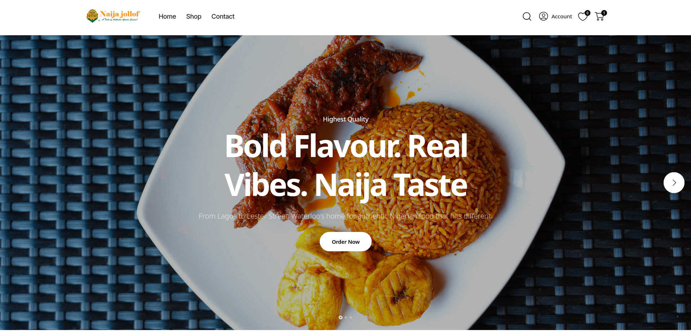
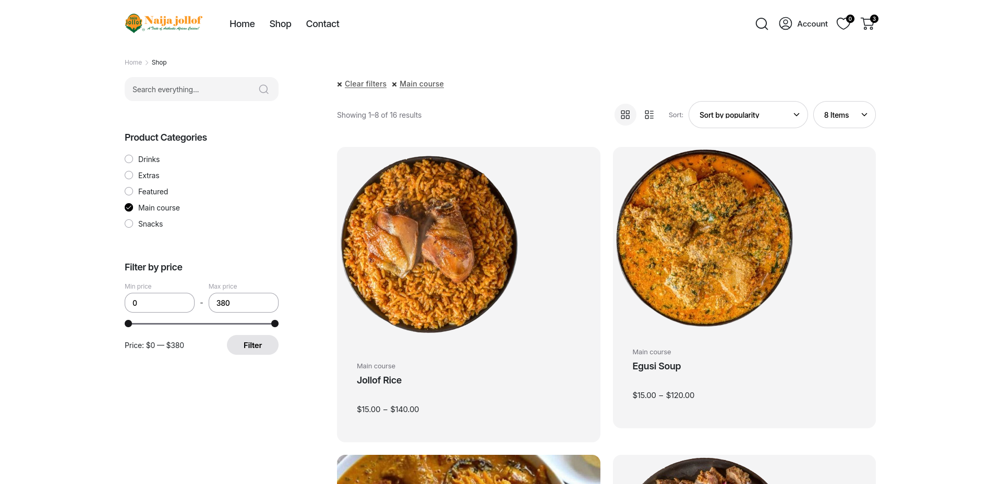
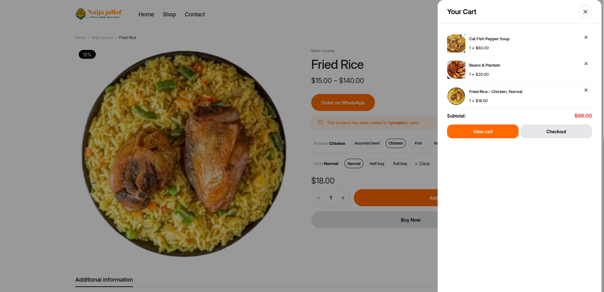

# Naija Jollof Food E-commerce Website

A modern, mobile-friendly food e-commerce platform for authentic Nigerian cuisine, serving the Waterloo area. This project showcases a custom online ordering experience, menu browsing, and user account management.

## 🚀 Features
- Bold, vibrant homepage with food photography
- Menu browsing with categories (main course, snacks, featured)
- User accounts and shopping cart
- Mobile-optimized design
- Custom UI components and enhancements
- Analytics: Track most sold items and user engagement

## 🛠️ Tech Stack
- PHP (custom backend logic)
- HTML, CSS, JavaScript (custom frontend)
- E-commerce integrations (cart, checkout, product catalog)
- Responsive/mobile-first design

## 👩🏽‍💻 My Role
- Full-stack development
- UI/UX design and customization
- Integration of e-commerce features
- Performance optimization

## 📸 Screenshots

  
  
  

  <b>Homepage</b> &nbsp;&nbsp;&nbsp;&nbsp; <b>Menu Page</b> &nbsp;&nbsp;&nbsp;&nbsp; <b>Cart Page</b>

## 🧩 Code Samples
See the `snippets/` folder for examples of:
- Custom utility functions
- Post view tracking logic
- Breadcrumb navigation builder

## 🌐 Live Demo
[naijajollofw.ca](https://naijajollofw.ca)

---

> This repository is for portfolio/display purposes only. Full source code is not included for security and copyright reasons. 

